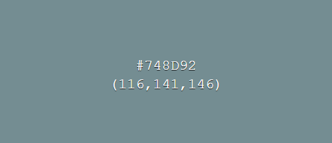
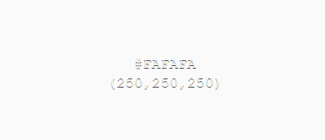
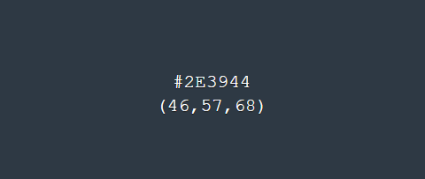
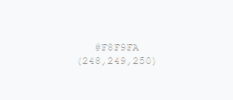
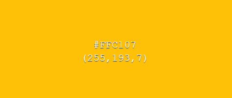
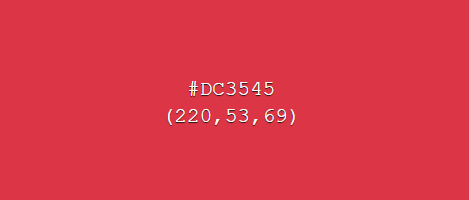
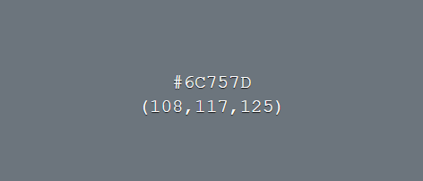

# MIXOLOGY MASTER 

[Link to a live site](https://mixologymaster-15c467037ed9.herokuapp.com/)

## INTRODUCTION 

Welcome to my third project, part of the Code Institute Full Stack Development Course.
The main purpose of this project is to build a fully functioning, full-stack web application.

Mixology Master is a free-to-use cocktail recipe platform. 

The user can browse through available cocktail recipes without an account.
The user can also add their own recipes after registering and logging into their account.
All logged-in users can download a free guide on how to add their own recipe.

### Thank you for visiting Mixology Master!

## UXD – User Experience Design

A user experience designer, Jesse James Garrett, introduced five UX design elements in his book The Elements of User Experience.
In the book, he explains the steps of user experience projects and what UX designers should consider at each stage.
This is where most of my planning process steps came from.

The 5 planes of UX are as below:

- The Strategy Plane
- The Scope Plane
- The Structure Plane
- The Skeleton Plane
- The Surface Plane

## The Strategy Plane

### Creator Goals :

- As a creator, I want my webpage to be user-friendly.
- As a creator, I want my webpage to be fully responsive.
- As a creator, I want my webpage to be functional.
- As a creator, I want my webpage to be easy to navigate.
- As a creator, I want the purpose of my webpage to be clear.
- As a creator, I aim to foster repeat visits to my webpage from users.

### User stories :

**GUEST USER** :

- As a guest user, I expect the webpage to be easy to navigate.
- As a guest user, I expect the purpose of the website to be explained right away.
- As a guest user, I expect the registration process to be seamless and efficient.
- As a guest user, I anticipate being able to easily browse through recipes without the need to create an account.

**LOGGED-IN USER**

- As a logged-in user, I expect the webpage to be easy to navigate.
- As a logged-in user, I expect the login process to be seamless and efficient.
- As a logged user, I expect the user dashboard to include all important information and functions.
- As a logged user, I anticipate being able to add and manage my own recipes.
- As a logged user, I anticipate being able to delete my account.

**User stories are based on online research and my relatives experiance.**

## The Scope Plane

The planning process allowed me to prioritize the implementation of features based on their importance to my user stories, 
enabling me to identify which ones could be completed within the given deadline and which ones would need to be postponed for later implementation.

#### Features implemented upon webpage release :

- Introduction on the homepage providing information on the art of bartending.
- Page dedicated to recipes featuring all available recipes for users.
- Verification system for users.
- Ability for logged-in users to create and manage their own recipes.
- User-friendly navigation bar for easy access to different pages.
- Footer with links to social media platforms.
- Contact form for users to communicate with the website owner/admin.
- User dashboard for account management, recipe creation, and guide downloads.
- Search bar functionality to help users browse through a variety of available recipes.

#### Fatures planned to implement later :

- Two-step authentication.
- Password retrieval.
- Option for logged-in users to upload an image of the cocktail when submitting a recipe.
- Ability to search for cocktails based on available ingredients.

*Above decisions have been made based on below table.*

| Feature       | Feasibility   | Importance    |
| ------------- |:-------------:|:-------------:|
|Navigation     | 5             | 5             |
|Introduction   | 5             | 5             |
|Verification   | 5             | 5             |
|Recipes page   | 5             | 5             |
|Social media   | 5             | 5             |
|Dashboard      | 5             | 5             |
|Contact page   | 4             | 5             |
|Two-step auth  | 4             | 3             |
|Password retr. | 4             | 4             |
|Search bar     | 4             | 5             |
|Ingrid search  | 3             | 4             |

## The Structure Plane

### Colors :

#748D92 :

- Body background
- Buttons

#FAFAFA :

- Text 
- Footer icons
- Links
- Buttons 
- User input (form)

#2E3944 :

- Navigation bar (background)
- Footer (background)
- Cocktail and user card (background) 
- View cocktail page (background)
- Specs page header (background)

#000 :

- Delete modal (text) 
- Info section (background with opacity of 0.3)
- Contact form (background with opacity of 0.3)

**Bootstrap default buttons colors** :

- #F8F9FA 

- #FFC107

- #DC3545 :

- #6C757D :

### Fonts :

**Roboto** :

- The choice of utilising the Roboto font from Google as the primary typeface was made due to its widespread popularity and user-friendly characteristics. With a focus on readability across various screen sizes, Roboto ensures an optimal user experience for all individuals accessing the content.

### Images :

Images for this project has been downloaded from : 

- [Gestational Diabates](https://www.gestationaldiabetes.co.uk)
- [Unsplash](https://unsplash.com/)
- [Pinterest](https://www.pinterest.co.uk/)

**More information in credits section.**

## The Skeleton Plane

As part of an ongoing effort to continually improve the project, I identified a number of key features that were previously missing and were negatively impacting the overall user experience. In order to address this, I implemented several significant changes to the project, aimed at enhancing usability and functionality.

**SIGIFICANT CHANGES ACROSS ALL WIREFRAMES** :
- In an effort to improve the overall user experience and simplify the layout of the page, I have made the decision to relocate the login and register buttons from their previous position below the navbar to the navbar itself.This change was motivated by feedback that the original placement was causing the page to appear cluttered and overwhelming. By integrating these buttons into the navbar, we can streamline the design and provide a more intuitive and user-friendly interface.
With this change, users will now have easy access to login and registration functionality directly from the main navigation bar without having to scroll down to a separate section. This update aims to enhance the overall usability and aesthetic appeal of the page, making it more appealing to users.

- Once a user logs in, the "Login" and "Register" buttons in the navbar are replaced with the "Dashboard" and "Logout" buttons. This change aims to provide a more personalised and streamlined experience for authenticated users. By providing a direct link to the dashboard, users can quickly access their personalised content and features without having to navigate through the application. Additionally, the "Logout" button offers a convenient way for users to sign out of their account when they are finished using the application. This update enhances the overall user experience by providing a more intuitive and contextual navigation menu that adapts to the user's login state.

[Recipes Page wireframes](./docs/wireframes/recipes-page.pdf)

- To enhance the discoverability of the webpage's extensive cocktail collection, I have added a cocktail category filter to the recipes page. This feature allows users to browse our selection of cocktails by their preferred alcohol type. By filtering by category, users can quickly find cocktails that match their taste preferences and interests.
I also optimised the layout of the webpage's cocktail display to provide a more streamlined and visually appealing experience. To achieve this, we have reduced the number of cocktails displayed in each row from 4 to 3. This change allows for a more balanced and harmonious layout, making it easier for users to focus on the featured cocktails and their descriptions. With this update, users can enjoy a more enjoyable browsing experience and discover new favourite cocktails with ease.

[Dashboard Page wireframes](./docs/wireframes/dashboard-page.pdf)

- I optimised the layout of the webpage's cocktail display to provide a more streamlined and visually appealing experience. To achieve this, we have reduced the number of cocktails displayed in each row from 4 to 3. This change allows for a more balanced and harmonious layout, making it easier for users to focus on the featured cocktails and their descriptions. With this update, users can enjoy a more enjoyable browsing experience and discover new favourite cocktails with ease.

- I decided to introduce a new Account Management section. This feature allows users to take control of their account settings and customise their experience on Mixology Master.
With this new section, users can now update their username, which provides an opportunity to personalise their identity on our platform. Additionally, I have added the ability to delete an account, giving users more control over their online presence and allowing them to easily remove their information from the database.

### ADDITIONAL PAGES :

**Unplanned Feature Addition: Account Management**

- During the development process, I introduced an unforeseen feature addition to the platform: the Account Management section on the user's dashboard. This section allows users to update their username and delete their account, providing an opportunity for them to personalise their identity on the platform. The page redirects to the new HTML page when the user changes their name. This change was not part of the original plan, and therefore, I did not create wireframes for this page.

**New User Interface: Dashboard and Admin Panel**

- In addition to the Account Management section, I also made significant changes to the user's dashboard and introduced an admin panel. The user's dashboard has been split into two separate sections: the user's new account management section and a "My Recipes" section, which displays a list of recipes they have added to the platform. The admin panel, on the other hand, allows administrators to manage all added recipes, including creating, editing, and deleting recipes. Due to these changes, I did not create wireframes for this page as it was not part of the original design plan.

## The Surface Plane

### Features present across the project :

### Navigation bar :

The navigation bar is a persistent feature on every page and has been designed to be fully responsive, ensuring an optimal user experience across all devices and resolutions. On mobile devices, the navigation bar automatically transitions to a hamburger menu, providing easy access to all additional pages and sections. This intuitive design enables users to navigate the site with ease, regardless of their device or screen size.

**Desktop** :

**Mobile** :

### Footer :

The footer is a consistently present element on every page, featuring a comprehensive design that is fully responsive and adaptable to all devices and screen resolutions. Additionally, the footer includes a section dedicated to social media links, which open in a new tab when clicked, allowing users to seamlessly engage with the organisation's online presence without disrupting their navigation experience.

### Hero image :

The hero image is strategically featured on the home page to immediately capture the user's attention and effectively communicate the purpose of the website. To ensure an optimal user experience, the hero image is designed to be responsive, seamlessly adapting to different screen sizes and devices. This means that users viewing the website on desktop computers will see a distinct hero image, while mobile device users will be presented with a tailored version that is optimised for their smaller screen size and mobile-specific navigation needs.

**Desktop** :

**Mobile** :

### Introduction section :

The introduction section of the website is designed to quickly convey the purpose and essence of the platform, allowing users to assess whether it is suitable for their interests within a brief timeframe. Following this initial section, a visually appealing divider image featuring a selection of fresh and tasty cocktails is prominently displayed. However, in consideration of mobile device users, this image is strategically hidden from view to prevent clutter and ensure an unobstructed user experience on smaller screens, ensuring that the content remains easily accessible and readable.

### Information section :

The "What's a Cocktail Spec?" and "Is a Bartender Kit Needed?" sections of this website provide valuable information for users looking to explore the world of cocktail-making. The "What's a Cocktail Spec?" section explains the concept of a cocktail specification, which is a detailed and precise recipe that includes the exact measurements of each ingredient, a specific type and brand of alcohol or mixer, the preparation method, and any garnishes or finishing touches. The "Is a Bartender Kit Needed?" section addresses the importance of having a basic bartender kit, which typically includes essential tools such as a shaker, jigger, strainer, muddler, and bar spoon. This information aims to educate users on the importance of accuracy and efficiency in cocktail preparation and provides guidance on how to get started with their own bartending journey.

### Recipes Page - header :

The Recipes page header section provides an overview of the purpose of this page, which is to showcase a curated collection of cocktail specifications (specs) for users to explore and create their own unique drinks. For logged-in users, this section also includes a feature to add their own cocktail spec, allowing them to contribute to the community and share their creations with others. This feature enables users to upload their own recipe, complete with measurements, ingredients, and preparation methods, making it easy to share and discover new cocktails with like-minded enthusiasts.

### Filter and Search bar :

The "Alcohol Type Filter" and "Search Bar" features enable users to quickly and easily discover the perfect cocktail recipe. The "Alcohol Type Filter" allows users to narrow down their search by selecting from a range of spirits, such as gin, whisky, rum, or vodka, to find cocktails that feature their preferred base spirit. The "Search Bar" enables users to search for cocktails by name. By combining these two features, users can rapidly locate and explore a vast array of cocktail recipes, making it easy to find the perfect drink to suit their taste preferences. On mobile devices, the "Alcohol Type Filter" toggles to the icon for easy access, allowing users to quickly switch between different spirit options without having to navigate through multiple menus.

**Desktop** :

**Mobile** :

### Cocktails section :

The cocktails section displays a collection of cocktail recipes, each presented in a visually appealing card format. The cards feature a cocktail icon, the drink's name, category, and description, as well as a brief summary of its ingredients and characteristics. Each card is linked to a detailed view of the cocktail, where users can learn more about its ingredients, preparation instructions, and other details. This section allows users to browse through a variety of cocktails and discover new recipes to try.

### Contact us section :

This contact form is designed to provide a convenient way for users to get in touch with admin. The form allows users to submit their name, email address, and message.

### "Thank you" / confirmation page :

This page serves as a confirmation of successful contact submission, displaying a friendly message to acknowledge receipt of the user's inquiry. The page provides a brief update on our expected response time, ensuring transparency and setting realistic expectations. A convenient 'Take me back!' button allows users to easily navigate back to the homepage, where they can continue exploring the platform or initiate a new contact request if needed. This page provides a seamless and user-friendly experience, ensuring that users feel valued and informed throughout the communication process.

### Register section :

The registration page allows users to create a personal account, giving them access to a secure area where they can manage their own cocktail recipes. Upon registration, users can choose a unique username and password, which will serve as their credentials for logging in to the platform.

### Login section :

The login page allows users to log into their personal account, giving them access to the user dashboard. By logging in, users can take ownership of their cocktail creations and enjoy a more personalised experience on the platform.

### Dashboard - account management section :

This feature allows users to take control of their account settings and customise their experience on Mixology Master. With this new section, users can now update their username, which provides an opportunity to personalise their identity on our platform. Additionally, the user has the ability to delete an account, giving them more control over their online presence and allowing them to easily remove their information from the database.

### Edit username section / page :

This page / feature allows users to modify their existing username, providing an opportunity to refresh their online identity or correct any typos. By filling out the updated information, users can submit their new username and save the changes. To ensure a seamless experience, this page includes checks to guarantee that the chosen username is unique and available for use, preventing any potential conflicts or duplicates. With this update feature, users can easily customize their account details and maintain a consistent online presence.

### Dashboard - cocktail management section :

The 'My Recipes' section is a personalised space where users can curate and manage their own collection of recipes, adding new ones, editing existing ones, and deleting any that are no longer needed. This feature allows users to easily access and organise their favourite recipes, making it simple to revisit and experiment with different flavours and combinations. Additionally, users can also access a complimentary guide on how to create effective recipes.

### Add cocktail page :

The 'Add Cocktail' page allows users to create and submit their own unique cocktail recipes to their personalised 'My Recipes' section. Users can fill out a form providing essential details such as cocktail name, description, and category (by selecting from a list of available alcohol types). Additionally, users can specify ingredients and prep instructions, allowing them to capture every detail of their recipe. Once the form is submitted, the new recipe will be added to their 'My Recipes' section, making it easily accessible and available for viewing on their dashboard.

### Edit cocktail page :

The 'Edit Cocktail' page is where users can refine and customise their cocktail recipes by making changes to the essential details. Users can update the recipe name and description and add or modify the ingredients and preparation instructions. They can also select the type of alcohol used in the recipe, ensuring accurate categorization and discovery by other users. Once saved, the updated recipe will be reflected on the recipes page and the user's dashboard.

### Admin panel :

The admin panel allows administrators to manage all added recipes, including creating, editing, and deleting recipes.

